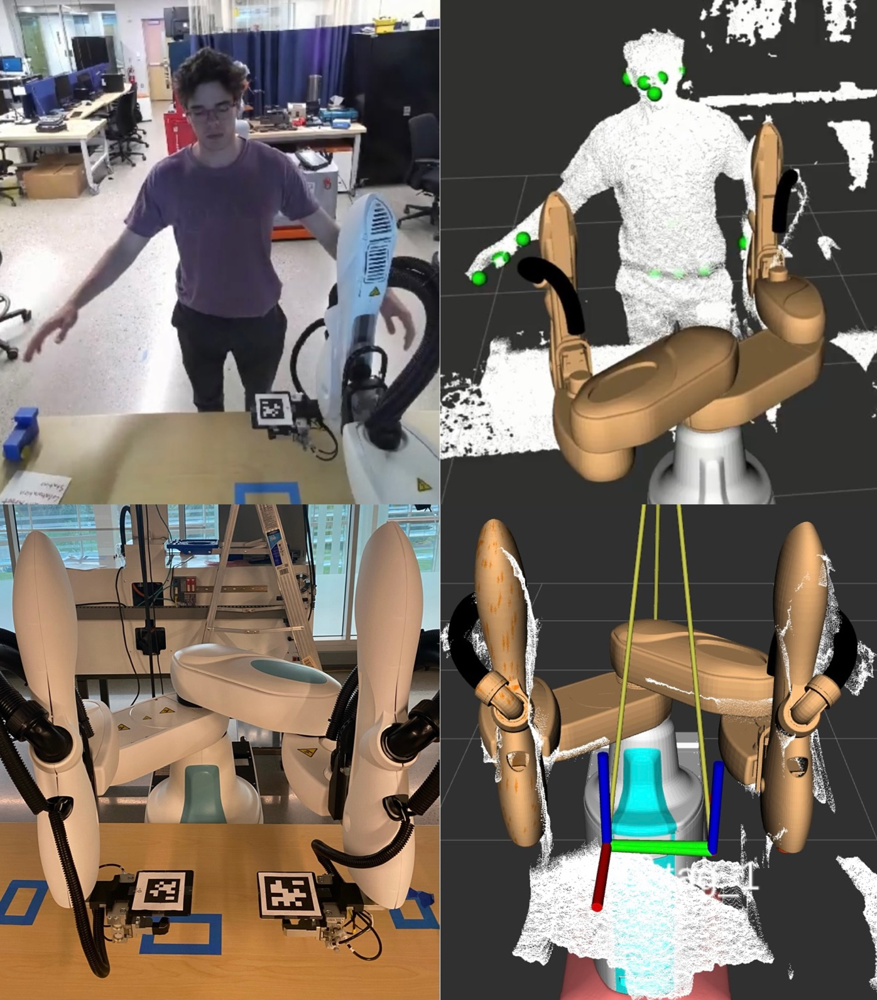

# HRC_extrinsic_calib
Extrinsic calibration on ROS of the Human Pose Estimation body joints performed from an Azure Kinect with a Collaborative Industrial robot in the context of Human Robot Collaboration (HRC).
{:width="200px" height="100px"}
